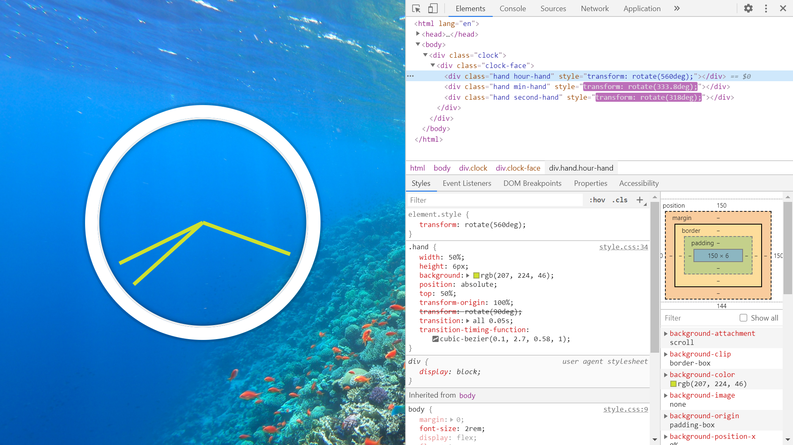

# Javascript Clock

Wes Bos Youtube Tutorial: [We build a CSS + JS Clock in Vanilla JS — #JavaScript30 2/30](https://www.youtube.com/watch?v=xu87YWbr4X0&list=PLu8EoSxDXHP6CGK4YVJhL_VWetA865GOH&index=2).

*** Note: to open web links in a new window use: _ctrl+click on link_**

## Table of contents

* [General info](#general-info)
* [Screenshots](#screenshots)
* [Technologies](#technologies)
* [Setup](#setup)
* [Features](#features)
* [Status](#status)
* [Inspiration](#inspiration)
* [Contact](#contact)

## General info

* Tutorial Code to create a working clock using just HTML, CSS & javascript.

## Screenshots

.

## Technologies

* Ran in Google Chrome browser with: [Javascript engine V8 7.9.317.32 for Windows (x64)](https://v8.dev/).

## Setup

* Open index.html in browser. If any code is changed the browser needs to be refreshed.

## Code Examples

* function to calculate position of clock hands using new Date().

```javascript
function setDate() {
  const now = new Date();
  console.log('now', now);
  
  const seconds = now.getSeconds();
  const secondsDegrees = ((seconds / 60) * 360) + 90;
  secondHand.style.transform = `rotate(${secondsDegrees}deg)`;
  
  const mins = now.getMinutes();
  const minsDegrees = ((mins / 60) * 360) + ((seconds/60)*6) + 90;
  minsHand.style.transform = `rotate(${minsDegrees}deg)`;
  
  const hours = now.getHours();
  const hoursDegrees = ((hours / 12) * 360) + ((mins/60)*30) + 90;
  hourHand.style.transform = `rotate(${hoursDegrees}deg)`;
}
```

## Features

*  Uses cubic-bezier css library for ease-in and ease-out of ticking clock hands.

## Status & To-Do List

* Status: Working.

* To-Do: Nothing

## Inspiration

* [We build a CSS + JS Clock in Vanilla JS — #JavaScript30 2/30](https://www.youtube.com/watch?v=xu87YWbr4X0&list=PLu8EoSxDXHP6CGK4YVJhL_VWetA865GOH&index=2).

## Contact

Repo created by [ABateman](https://www.andrewbateman.org) - feel free to contact me!